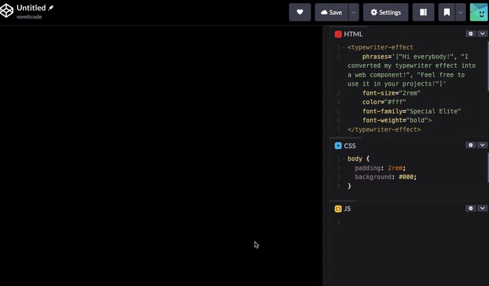

# Typewriter Web Component

  
  
A reusable web component that creates a classic typewriter effect with customizable styling. The component displays phrases character by character, simulating the look and feel of an old typewriter, then deletes the text before displaying the next phrase.

## Features

- Classic typewriter animation with realistic timing variations
- Blinking cursor effect
- Customizable font size, color, weight, and family
- Works on any background
- Fully encapsulated with Shadow DOM
- No external dependencies
- Responsive and accessible

## Installation

Include the component in your html head section directly from the CDN:

```html
<script src="https://raw.githack.com/DevManSam777/typewriter-web-component/main/typewriter-component.js"></script>
```

## Usage

### Basic Usage

```html
<typewriter-effect phrases='["Hello World!", "Welcome!", "Enjoy the effect!"]'></typewriter-effect>
```

### Custom Styling

```html
<typewriter-effect 
    phrases='["Custom text!", "Any color!", "Any size!"]'
    font-size="2rem"
    color="#e74c3c"
    font-family="Courier New, monospace"
    font-weight="bold">
</typewriter-effect>
```

### Inline Usage

```html
<p>This is text with <typewriter-effect phrases='["inline typing"]' style="display: inline;"></typewriter-effect> in it.</p>
```

## Styling

The component provides attributes for text styling (font, color, size, weight). For layout and positioning styles, use the `style` attribute on the component:

```html
<typewriter-effect 
    phrases='["Centered text!", "With custom spacing!"]'
    style="display: block; text-align: center; margin: 20px 0; padding: 10px;">
</typewriter-effect>
```

**Note:** Due to Shadow DOM encapsulation, only layout/positioning styles work with the `style` attribute (display, margin, padding, position, text-align, etc.). For text styling, use the component's attributes instead.

## Using Google Fonts

To use Google Fonts, import them in your HTML head section and reference them in the `font-family` attribute:

```html
<head>
    <link rel="preconnect" href="https://fonts.googleapis.com">
    <link rel="preconnect" href="https://fonts.gstatic.com" crossorigin>
    <link href="https://fonts.googleapis.com/css2?family=Special+Elite&display=swap" rel="stylesheet">
</head>
<body>
    <typewriter-effect 
        phrases='["Using Google Fonts!", "Special Elite font!", "Very stylish!"]'
        font-family='"Special Elite", serif'>
    </typewriter-effect>
</body>
```

## Attributes

| Attribute | Description | Default | Example |
|-----------|-------------|---------|---------|
| `phrases` | JSON array of phrases to display | `["Hello World!"]` | `'["Text 1", "Text 2"]'` |
| `font-size` | CSS font size | `3rem` | `2rem`, `24px`, `1.5em` |
| `color` | Text color | `#333333` | `#ff0000`, `blue`, `rgb(255,0,0)` |
| `font-family` | Font family | `"Courier New", monospace` | `Arial, sans-serif`, `"Special Elite", serif` |
| `font-weight` | Font weight | `normal` | `bold`, `light`, `400` |
| `cursor-color` | Cursor color | Same as text color | `#ff0000`, `blue` |

## Examples

### Default Typewriter
```html
<typewriter-effect phrases='["Hello World!", "Welcome to my site!", "This is awesome!"]'></typewriter-effect>
```

### Large Red Text
```html
<typewriter-effect 
    phrases='["Big red text!", "Very noticeable!", "Hard to miss!"]'
    font-size="4rem"
    color="#e53e3e">
</typewriter-effect>
```

### Monospace Style
```html
<typewriter-effect 
    phrases='["Code style text", "Perfect for tech sites", "Monospace is cool"]'
    color="#2d3748"
    font-weight="bold">
</typewriter-effect>
```

### Google Font Style
```html
<typewriter-effect 
    phrases='["Special Elite font", "Classic typewriter feel", "Very authentic"]'
    font-family='"Special Elite", serif'
    color="#4a4a4a">
</typewriter-effect>
```

### Small Subtitle
```html
<typewriter-effect 
    phrases='["Small subtitle", "Elegant and subtle", "Perfect for captions"]'
    font-size="1.2rem"
    color="#666666"
    font-weight="light">
</typewriter-effect>
```

## Animation Behavior

- **Typing Speed**: Random variation between 0-300ms per character for natural feel
- **Deletion Speed**: Random variation between 0-150ms per character
- **End Pause**: 2-second pause after each phrase completes before deletion begins
- **Cursor Blink**: 400ms interval with smooth transitions

## Browser Support

Works in all modern browsers that support:
- Custom Elements (Web Components)
- Shadow DOM
- ES6 Classes

## Notes

- The component inherits the background from its parent element
- Default font is Courier New for a classic typewriter feel
- Import Google Fonts in your HTML head to use custom fonts with the `font-family` attribute
- Phrases should be valid JSON array format
- Component is fully self-contained and won't conflict with existing styles

## License

Copyright (c) 2025 Samir Shuman

This project is free to use and modify. Feel free to adapt it for your own purposes.